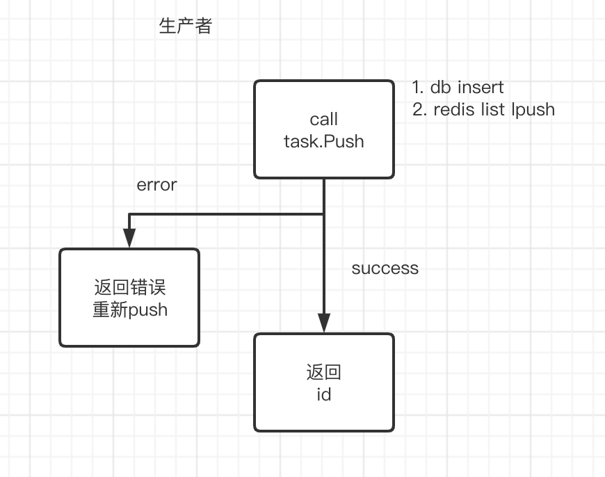
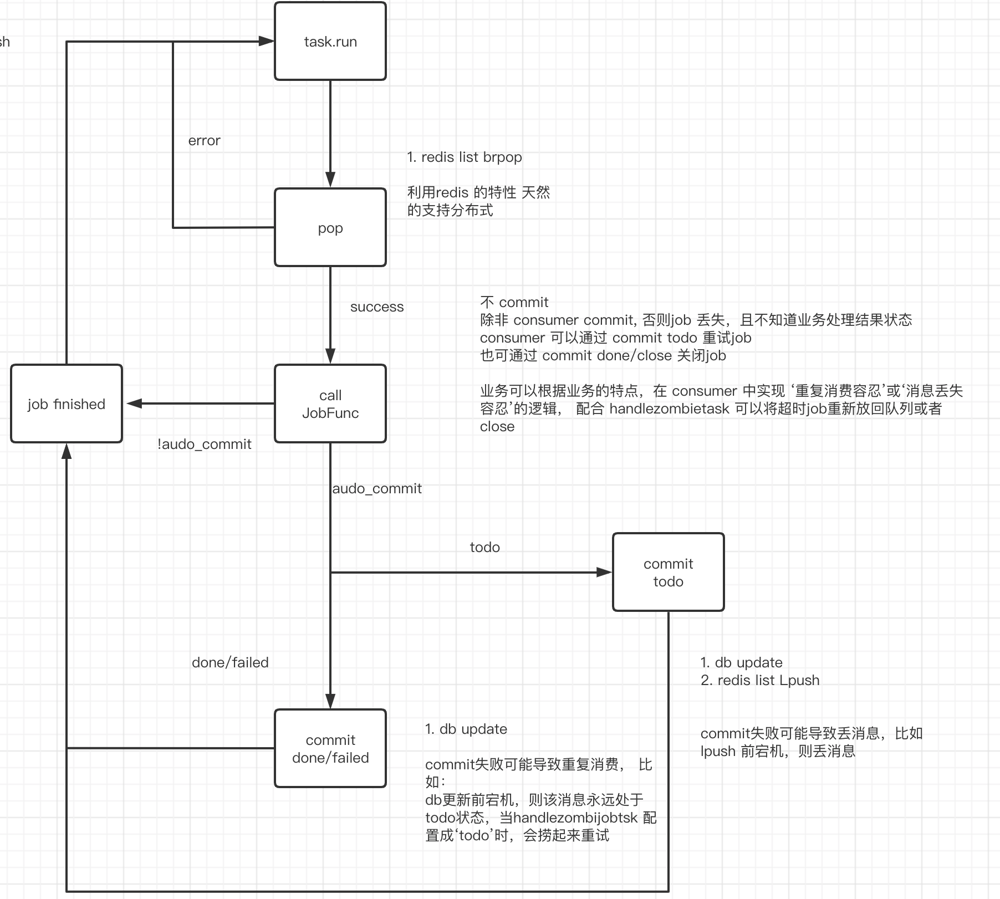
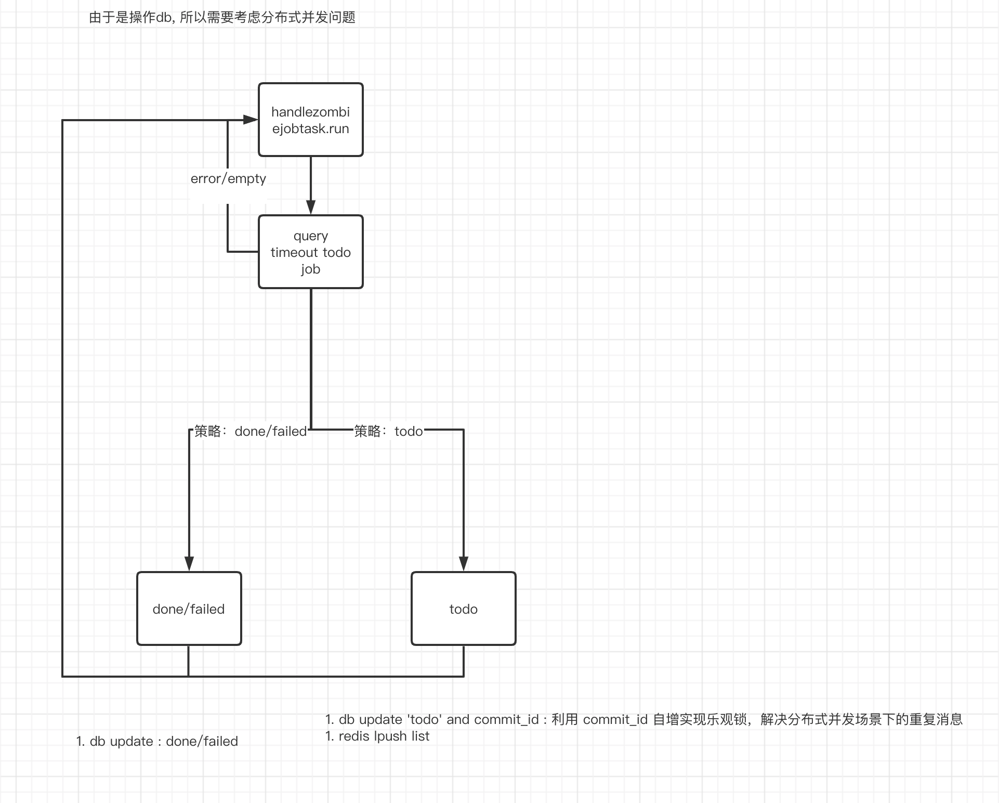
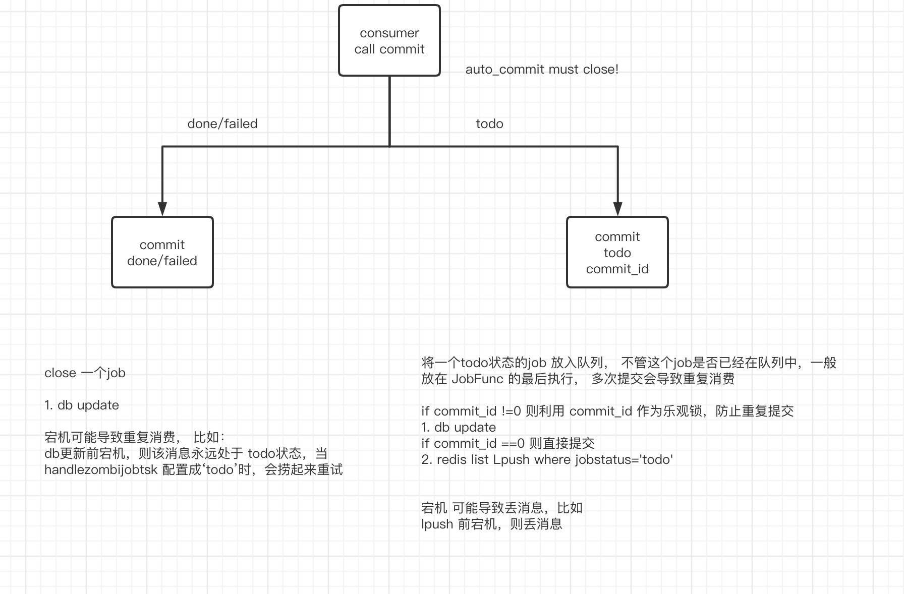
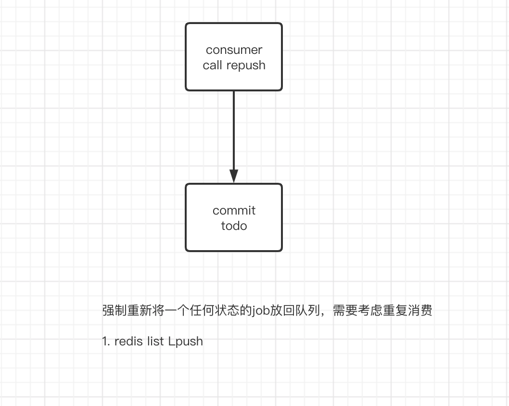

# Meepo 简介
基于redis实现的分布式异步任务框架，同时使用mysql持久化任务消息，实现redis宕机等意外丢消息情况下重试

# Meepo 架构说明

## 生产者
  

## 消费者
  

## 超时任务处理
  

## 手动commit job状态
  

## 强制repush job
  

## 使用配置说明

### 自动commit模式
- 配置 task
```
mytask := task.MustNewTask(context.Background(), // context, 可以cancel掉task
		"my_task_0831", // taskID, required
		DB,  // mysql conn, required
		Client, // redis client, required
		task.SetJobFunc(MyJob), // 配置消费者函数
		task.SetParallelNum(10), // 配置消费者并发数量， 当同时配置消费者函数和消费者并发数量时，会运行消费者协程
		task.SetMaxFailedTimes(3), // 自动模式下重试次数，3则表示同一个job执行3次都失败后会commit成failed状态
		task.SetHandleZombieJobsDstStatus(task.JobStatusTodo), // 处理超时job：重置超时job状态， todo会重试，failed和done会close.
		task.SetHandleZombieJobsPeriod(time.Second*20), // 处理超时job: 轮训周期.
		task.SetHandleZombieJobsTimeout(time.Second*20), // 处理超时job: 设置job超时时间. 只有在运行消费者协程的情况下才会运行处理超时job的协程. 处理超时job的协程目的是将系统意外丢消息或者其他原因导致的超时job捞起来，按照策略重试或者关闭. 
		task.SetHandleZombieJobsLimit(1000), // 抽离超时job: 协程一次query db的limit
		task.SetTableName("t_my_job_0831"), // 设置db table name, 如果没有设置会默认为 't_common_job_'+[task_id], 前提是有DDL权限。
		task.SetListNamePrefix("l_my_job_0831"), // 设置redis list name的prefix, listname=[prefix]+[task_id], 默认为listname='l_common_job_'+[task_id]
		task.SetInitDB(true), // 设置是否初始化DB, true会创建db table, 要求有DDL权限.
	)
```
- 发送消息
```
// 需要拿到 mytask 对象 
mytask.Push([]byte("hello"))  
```  
一般将消息定义成pb或者json, 方便使用

- 消费者函数
```
// JobFunc example
func MyJob(ctx context.Context, id, fts, cID int64, payload []byte) error {

	fmt.Println("MyJob assigned job: ", id, string(payload))

	// then, do something
	fmt.Println("do something ...")

	// return if error with succ=false
	if id%99 == 0 {
		return fmt.Errorf("mock error")
	}

	return nil

}
```
参数job id可以与业务关联  
参数failed_times可以与业务关联  
不需要commit, 且call Commit会报错  

### 手动commit模式
- 配置 task
```
mytask := task.MustNewTask(context.Background(), // context, 可以cancel掉task
		"my_task_0831", // taskID, required
		DB,  // mysql conn, required
		Client, // redis client, required
		task.SetJobFunc(MyJob), // 配置消费者函数
		task.SetParallelNum(10), // 配置消费者并发数量， 当同时配置消费者函数和消费者并发数量时，会运行消费者协程
		task.SetMaxFailedTimes(3), // 自动模式下重试次数，3则表示同一个job执行3次都失败后会commit成failed状态
		task.SetHandleZombieJobsDstStatus(task.JobStatusTodo), // 处理超时job：重置超时job状态， todo会重试，failed和done会close.
		task.SetHandleZombieJobsPeriod(time.Second*20), // 处理超时job: 轮训周期.
		task.SetHandleZombieJobsTimeout(time.Second*20), // 处理超时job: 设置job超时时间. 只有在运行消费者协程的情况下才会运行处理超时job的协程. 处理超时job的协程目的是将系统意外丢消息或者其他原因导致的超时job捞起来，按照策略重试或者关闭. 
		task.SetHandleZombieJobsLimit(1000), // 抽离超时job: 协程一次query db的limit
		task.SetTableName("t_my_job_0831"), // 设置db table name, 如果没有设置会默认为 't_common_job_'+[task_id], 前提是有DDL权限。
		task.SetListNamePrefix("l_my_job_0831"), // 设置redis list name的prefix, listname=[prefix]+[task_id], 默认为listname='l_common_job_'+[task_id]
		task.SetInitDB(true), // 设置是否初始化DB, true会创建db table, 要求有DDL权限.
		task.SetAutoCommit(false), // 关闭自动commit, 需要消费者函数call commit，否者job永远处于todo状态。直到可能被处理愁啊会死job的协程捞起来。
	)
```
- 发送消息
```
// 需要拿到 mytask 对象 
mytask.Push([]byte("hello"))  
```  
一般将消息定义成pb或者json, 方便使用

- 消费者函数
```

// JobFunc example
func MyJob(ctx context.Context, id, fts, cID int64, payload []byte) error {

	succ := false

	defer func() {
		if succ {
			mytask.Commit(id, cID, task.JobStatusDone)
		} else {
			if fts+1 >= 5 {
				mytask.Commit(id, cID, task.JobStatusFailed)
			} else {
				mytask.Commit(id, cID, task.JobStatusTodo)
			}
		}
	}()

	fmt.Println("MyJob assigned job: ", id, string(payload))

	// check for Idempotent
	fmt.Println("check for idempotent...")

	// then, do something
	fmt.Println("do something ...")

	// return if error with succ=false
	if id%99 == 0 {
		return fmt.Errorf("mock error")
	}

	succ = true

	return nil

}
```
参数job id可以与业务关联  
参数failed_times可以与业务关联  
需要手动call Commit  
可以根据 failed_times来设置job failed状态  